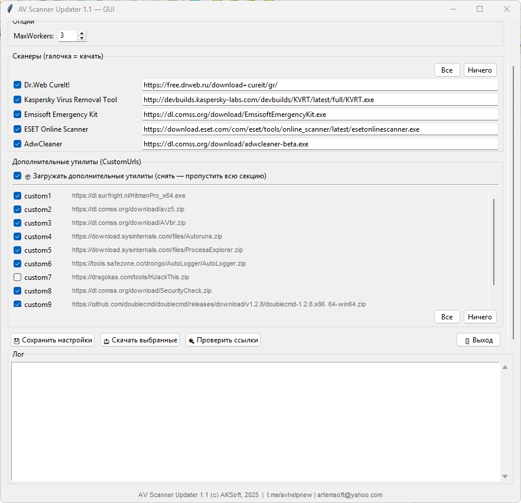
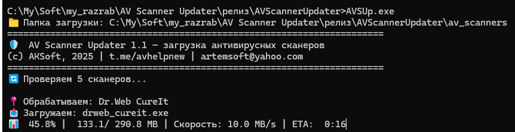

# AV-Scanner-Updater 1.1

* * *

ЧТО ЭТО
-------
Утилита для автоматической загрузки актуальных версий антивирусных
сканеров и вспомогательных утилит.

ПОДДЕРЖИВАЮТСЯ
--------------
- Dr.Web CureIt!
- Kaspersky Virus Removal Tool (KVRT)
- Emsisoft Emergency Kit
- ESET Online Scanner
- AdwCleaner (beta-канал)
- любые свои ссылки через секцию `[CustomUrls]`

ДВЕ ВЕРСИИ
----------

 ` av_gui.exe`  — графический интерфейс, для обычного пользователя.

 ` AVSUp.exe`   — командная строка, для скриптов и планировщика.
 





КАК ЗАПУСТИТЬ (GUI)
-------------------
  2. При первом запуске рядом появятся:
  ```cmd
       av_config.ini   — настройки
       av_scanners\    — сюда качаются файлы
  ```
  3. Отметьте галочками нужные сканеры.
  4. Нажмите «📥 Скачать выбранные».

Кнопка «🔍 Проверить ссылки» делает HEAD-запрос по всем URL'ам —
удобно, чтобы поймать битые ссылки до загрузки.


КАК ЗАПУСТИТЬ (CLI)
-------------------
```cmd
  AVSUp.exe                    — загрузить всё, что включено в INI
  AVSUp.exe --no-wait          — не ждать Enter в конце
  AVSUp.exe --quiet            — минимум вывода
  AVSUp.exe -c custom.ini      — другой конфиг
```

ГДЕ ЛЕЖИТ КОНФИГ
----------------
 ` av_config.ini` — рядом с exe. Если его нет, программа создаст его из
  встроенного шаблона при первом запуске.


ИСТОРИЯ ЗАГРУЗОК
----------------

` av_scanners\download_history.json` — что и когда качалось  
 ` av_scanners\download_report.json`  — итоги последнего запуска


АНТИВИРУС МОЖЕТ РУГАТЬСЯ
------------------------
Программа качает exe-файлы с интернета — Defender и другие антивирусы
могут реагировать. Добавьте папку в исключения, если появятся ложные
срабатывания.


ТРЕБОВАНИЯ
----------
  • Windows 7/8/10/11 (64-бит)
  • Интернет

## Для связи

- Телеграм: t.me/avhelpnew
- Почта: artemsoft@yahoo.com
- Новые версии: https://github.com/artemsoft2025

